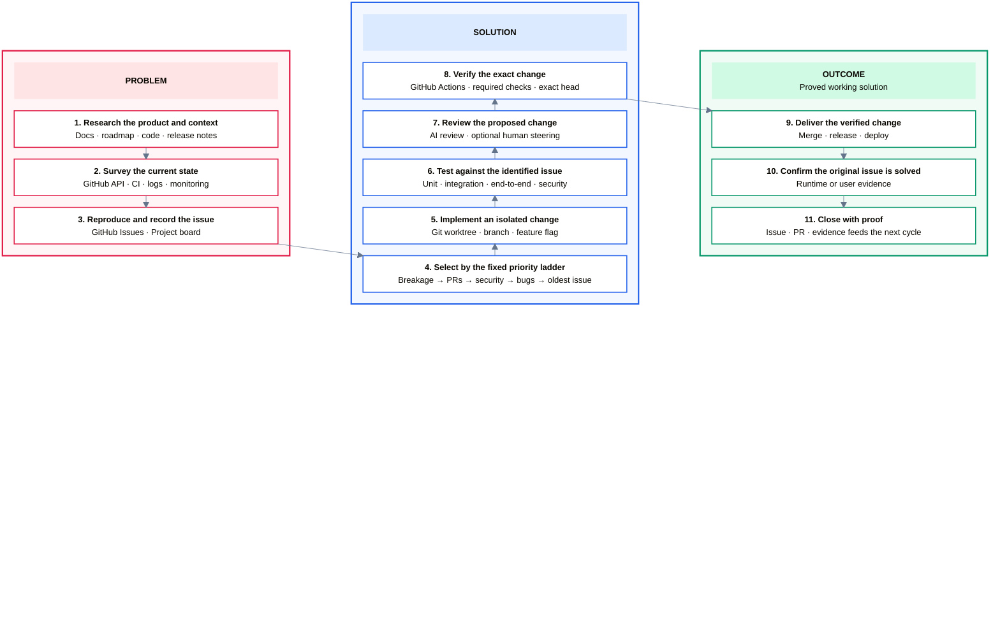

I use a scheduled **Agentic Engineer** as the primary engineer across the Devantler Tech portfolio. It operates products by keeping them healthy and advances them by improving their direction, capabilities, and quality.

The process is deliberately concrete. The useful result is not generated code or an open pull request. It is a problem understood, a change verified, and a working solution proved against the original issue.

## The process

Read the numbered arrows down **Problem**, upward through **Solution**, and then down **Outcome**. The outer boxes only categorize the work; the activities form the actual sequence.

## Problem: research and identify

The first category is the work required to understand the problem before changing anything.

1. **Research the product and context.** Read the current documentation, roadmap, code, and release history.
2. **Survey the current state.** Check live repository state, CI, logs, monitoring, open work, and ownership.
3. **Reproduce and record the issue.** Turn the finding into a concrete GitHub Issue and place it in the portfolio project.

The output is an evidence-backed problem statement, not a guess or a task chosen because it is easy to automate.

## Solution: select, implement, test, and verify

The solution begins only after the problem is known.

1. **Select the first actionable task in the fixed priority ladder.** Work top-down through live breakage, open pull requests, security issues, bugs, and then the oldest actionable issue. Do not descend while a higher rung still has actionable work.
2. **Implement in isolation.** Use a dedicated worktree and branch so concurrent agents cannot overwrite one another.
3. **Test against the identified issue.** Combine focused tests with the repository's wider lint, integration, end-to-end, and security checks.
4. **Review the proposed change.** Use a draft pull request for required AI review and optional human steering without implying that the work is ready.
5. **Verify the exact change.** Bind the evidence to the current pull-request head. A review or CI run for an older commit does not clear a newer one.

## Outcome: prove the working solution

Delivery is part of the proof, not the end of it.

1. **Deliver the verified change.** Merge, release, or deploy through the product's normal path.
2. **Confirm the original issue is solved.** Use runtime, user, or other product-level evidence appropriate to the change.
3. **Close with proof.** Record the evidence on the issue and pull request so it informs the next research cycle.

Static checks can prove properties of code. They cannot manufacture missing deployment or user evidence. Runtime-sensitive work remains incomplete until the required proof exists.

## What the tools contribute

- **GitHub Issues and the Project board** record problems, priorities, dependencies, and ownership.
- **Git worktrees and branches** isolate implementation from concurrent work.
- **Pull requests and reviews** make the exact proposed change inspectable.
- **GitHub Actions** runs deterministic quality, test, and security checks.
- **Runtime and user evidence** confirms that the delivered behavior resolves the original problem.

For the reasoning behind this structure, read [How My Agentic Engineer Turns Problems into Proved Working Solutions](/blog/how-my-agentic-engineer-turns-problems-into-proved-working-solutions/).
