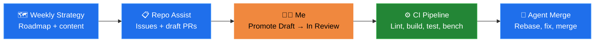
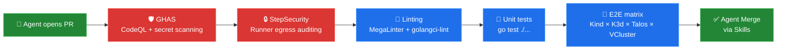

A Mac Mini runs 24/7 in my house on Funen. It doesn't serve media, it doesn't compile code, it doesn't host a website. Its only job is to fire scheduled prompts at GitHub agents so they can work on [KSail](https://github.com/devantler-tech/ksail) in the background.

Left unsupervised, autonomous agents tend to produce a lot of *output* and not a lot of *outcomes* — PRs that don't compile, issues that duplicate each other, roadmaps that drift from reality. I've hit all of those failure modes running this setup.

The thing that keeps it usable is that autonomy isn't really the goal. The goal is narrowing the agents' scope enough, and layering enough checks, that the failure modes get caught before they reach me. I stay in the loop at one place: the Draft → In Review transition. Everything else is automated.

This post is about how I've arranged that.

## How I Think About Autonomy

An agent that's free to do anything will eventually do something I don't want. I don't try to stop that from happening — I try to make sure it gets caught.

That shapes the setup in three ways:

1. **Each workflow has a narrow scope** so there's a clear definition of "done" and not much room to improvise.
2. **Deterministic guardrails sit between agent output and main** — lint, tests, security scans. The kinds of checks that don't negotiate.
3. **One human decision stays in the loop**: promoting a draft PR to In Review. That's where I can still veto.

Nothing here is novel; it's just what I've ended up with after iterating.

## The Pipeline: Six Agentic Workflows

KSail runs six [GitHub Agentic Workflows](https://github.com/githubnext/agentics), each with a narrow scope and its own schedule. They're implemented as Markdown prompt files that the `gh-aw` extension compiles into GitHub Actions workflows.

- **Weekly Strategy** — Runs Monday and Wednesday. On Monday it analyzes recent issues, discussions, and competitor tools (Tilt, Skaffold, DevSpace, and the rest) and publishes a Now / Next / Later roadmap. On Wednesday it turns the roadmap into promotional content — a Reddit post, a LinkedIn snippet, or a blog draft.
- **Repo Assist** — Runs every 12 hours. This is the busiest workflow. It picks a task via weighted random selection from 12 categories (labelling issues, investigating bugs, cleaning up stale PRs, translating roadmap items into backlog issues, writing small code improvements). Weights adjust based on repo state — if there are a lot of unlabelled issues, labelling gets heavier.
- **Daily Docs** — Runs daily and on every push to `main`. Syncs documentation with code changes, and on a separate schedule scans for bloat and simplifies redundant pages. Knows which files are auto-generated and refuses to edit them.
- **Daily Workflow Maintenance** — Runs daily. Updates action versions, applies [`gh-aw`](https://github.com/githubnext/agentics) codemods, recompiles workflow lock files. If there's nothing to update, it switches into a deeper mode that analyzes CI metrics and proposes optimizations.
- **CI Doctor** — Runs on failure. When any monitored workflow fails, CI Doctor pulls the logs, runs pattern matching against previous investigations, categorizes the root cause, and files an issue with a recommended fix.
- **Agentics Maintenance** — Runs every two hours. Closes expired discussions, issues, and PRs; keeps labels in sync. Mostly janitorial.

Each workflow has a single sentence that describes what it's allowed to do. None of them can merge. None of them can close another workflow's PR. Most of them can only open drafts.

## How Autonomy Is Obtained

The workflows run on GitHub-hosted runners, but the *prompts* that kick them off are scheduled on my Mac Mini via a simple cron-like setup. Why a physical machine and not just GitHub's built-in schedule triggers? Two reasons:

1. **I can dispatch prompts on demand.** When I'm drafting an idea and want Repo Assist to pick it up immediately, I trigger it from the Mac Mini rather than waiting for the next 12-hour window.
2. **The prompts are themselves versioned locally**, so I can iterate on them the same way I iterate on code — edit, test, commit, push. Keeping them on a machine I can see keeps the feedback loop tight.

The flow from idea to merged PR looks like this:

Weekly Strategy produces the "what to work on." Repo Assist turns that into issues and, where appropriate, draft PRs. Everything sits in Draft until I promote it. CI runs on every change. Agent Merge (implemented as a [Skill](https://github.com/features/copilot-skills)) rebases and addresses final review feedback.

## The Guardrails

Scheduled prompts are the easy part. The guardrails are what make the output something I'm willing to merge. Every PR — agent or human — goes through the same stack.

What each layer does:

- **GHAS + CodeQL** catches the class of bugs where an agent confidently introduces an injection or an unvalidated input. Cheap to enable and it has caught real issues.
- **StepSecurity** hardens the runners. `egress-policy: audit` on every job means I can see which hosts a workflow is talking to, which matters when agents occasionally try to fetch from somewhere unexpected.
- **MegaLinter and golangci-lint** keep the stylistic and correctness conventions consistent. Agents will write idiomatic Go for a while and then forget `errcheck` on one function; linters notice.
- **Unit tests** run on every PR via `go test ./...`.
- **E2E / system tests** run on the merge queue across a matrix of distributions (Kind, K3d, Talos, VCluster) and providers (Docker, Hetzner, Omni). This is the slow and expensive layer, and also where most agent-introduced regressions actually get caught.
- **Agent Merge via Skills** handles the final rebase and review-feedback dance. It can't bypass any of the above.

None of these layers take the agent's word for anything — they check independently. That's the whole point.

## My Role

Most of what I do on KSail day-to-day is promote draft PRs to In Review. I read the diff, read the linked issue, decide whether the change actually fits the roadmap, and either promote it or close it.

Beyond that:

- 👀 **Occasional check-ins** to sanity-check direction — am I comfortable with where the roadmap is going? Are there issues getting closed that shouldn't be?
- 🛠️ **Jumping in to build something myself** when I feel like coding. I use the same workflow — draft PR, CI, agent merge — so nothing is bypassed.

Nothing merges without me promoting it. Agent Merge waits for `In Review`; `In Review` only happens when I click the button.

## What I've Learned

A few observations from running this for a while. These are my experiences, not prescriptions.

**The model matters more than the prompt.** A weaker model produces worse initial output and struggles with anything that has a larger scope. Running the same workflow against a mid-tier model versus a frontier model, the frontier model is the one that ends up shipping usable code. The prompt helps, but it isn't going to rescue a weak base.

**Before Agentic Workflows, working with AI was tedious.** I'd open a chat, paste context, iterate, copy results back, paste into a PR. The overhead per task was high enough that I used AI sparingly. Scheduled workflows changed that shape — the AI runs whether I'm paying attention or not, and I review in batch.

**I don't really trust AI to do a good job.** That sounds harsh, but it's the honest frame I operate from. I don't assume a PR is correct; I assume it needs to prove itself against the checks. When CI, lint, and the E2E matrix all go green, that's something closer to evidence. Without that stack I don't think I'd run any of this.

**The work shifts from coding to validation.** My days look different now. Less time writing code, more time reading diffs, promoting drafts, and deciding whether a change fits the roadmap. The work didn't disappear, it just moved.

**Autonomous AI leans hard on good tooling.** Without GHAS and StepSecurity I'd be more anxious about letting agents open PRs on their own. I'm not saying nobody should run autonomous workflows without them — I'm saying I wouldn't.

**Working code beats sexy code, and I had to learn that the hard way.** My instinct is to factor, generalize, make things elegant. Newer models scratch that same itch when they get it right, which feels great. But when they duplicate code that didn't need to be duplicated, it feels *worse* than if I'd written the duplication myself. Where I've landed: let the agent ship working code first, and treat refactoring as a separate, deliberate task.

**Adding signals to the feedback loop helps.** CI Doctor is a good example. A failing workflow can churn for days before an agent converges on a fix — often on things I could probably debug faster if I sat down with it myself. The trade-off is autonomy: it eventually gets there without me. New signals I've added to the loop (test coverage reports, benchmark regressions, lint summaries) have all made that convergence more reliable, even when they don't make it faster.

**Scheduling from a physical machine isn't strictly necessary.** Most of these schedules could move to GitHub's built-in cron. I keep the Mac Mini because it's one place where I can see what's running, what's queued, and what I'm iterating on — more of a dashboard than a trigger. That framing is worth more to me than the technical utility.

## Closing

The goal of this setup isn't to remove myself from the project. It's to move the tedious parts (triage, labelling, dependency updates, docs drift) onto agents, while keeping the parts that benefit from judgment (scope, design, what merges) with me.

If you want to see the workflow files, they live in [`.github/workflows/`](https://github.com/devantler-tech/ksail/tree/main/.github/workflows) in the KSail repo — every `*.md` file in that folder is one of the agentic workflows described here. The compiled `*.lock.yml` files are the GitHub Actions that actually run. The setup is built on top of [githubnext/agentics](https://github.com/githubnext/agentics), which provides the `gh-aw` CLI and the workflow prompt framework.
